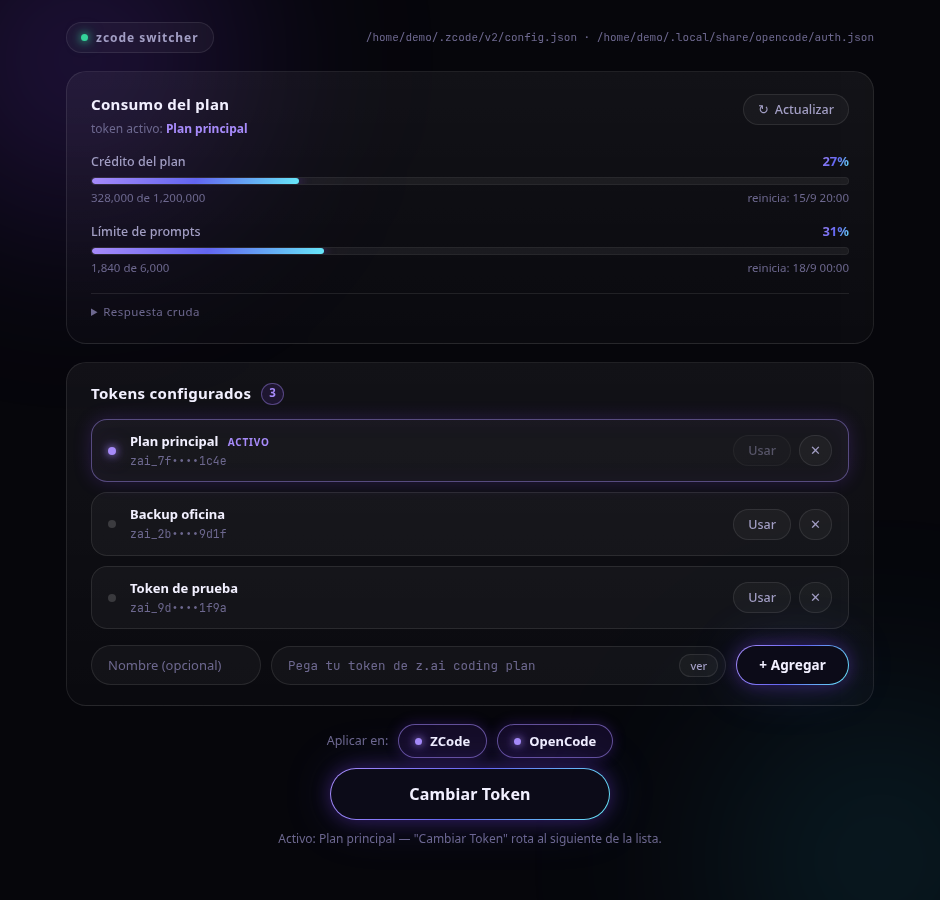
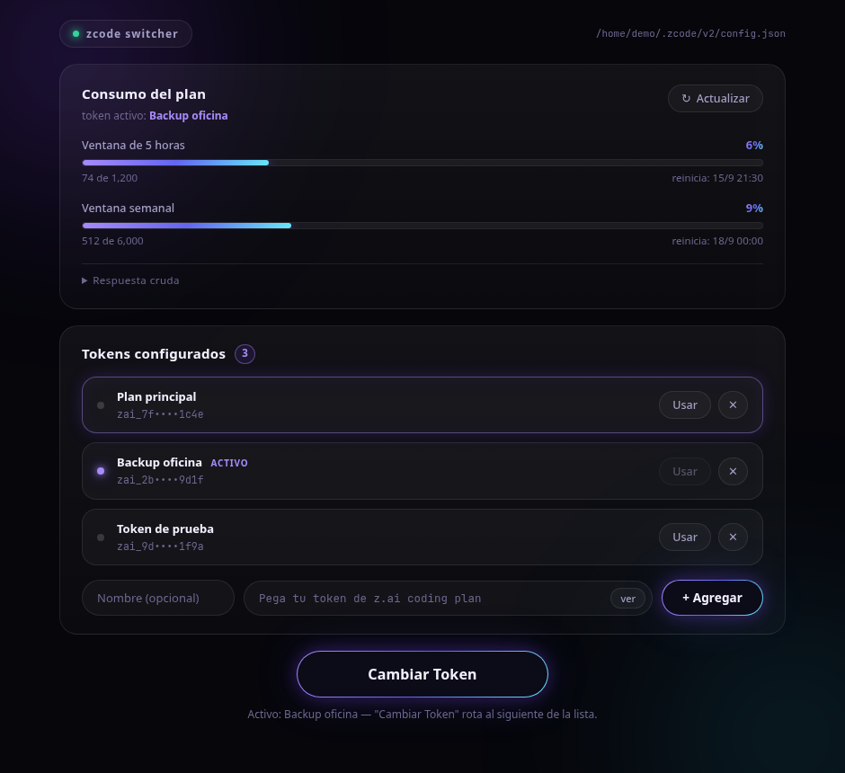

# zcode Switch Token

Desktop manager (Linux / Windows / macOS) for your **z.ai coding-plan** tokens, built with Tauri 2 + Vue 3 + TypeScript.

Store one or more tokens, check your plan's quota usage at a glance, and hot-swap the active token straight into zcode's config.

| Main view | After "Cambiar Token" |
| --- | --- |
|  |  |

## Features

- **Multi-token**: add as many z.ai tokens as you need; the list persists in the app's own config (never inside zcode's).
- **Cambiar Token**: one click rotates round-robin to the next configured token and applies it.
- **Quota card**: live usage from `GET https://api.z.ai/api/monitor/usage/quota/limit` (`Authorization: Bearer $TOKEN`), fetched Rust-side (reqwest + rustls) to avoid webview CORS. Unknown response shapes fall back to a raw JSON view.
- **Safe config writes**: reads zcode's `config.json` → modifies only the token fields → writes atomically (temp file + rename), keeping a one-shot `config.json.bak` backup. Everything else in the config is preserved.
- **Native View Transitions** on supported webviews (Windows / macOS), instant updates elsewhere.

## How it works

The active token is written into zcode's own config file, resolved from the user home directory on each platform:

| OS | zcode config path |
| --- | --- |
| Linux | `/home/$USER/.zcode/v2/config.json` |
| Windows | `C:\Users\$USER\.zcode\v2\config.json` |
| macOS | `/Users/$USER/.zcode/v2/config.json` |

The key is written to both `provider.builtin:zai.options.apiKey` and `provider.builtin:zai-coding-plan.options.apiKey` (and stale `systemDisabledReason` flags are cleared), so the switch takes effect no matter which provider zcode resolves. zcode rewrites this file on its own, so the app never caches it — every switch is a fresh read → modify → write cycle.

Token list lives in the app config dir (`tokens.json`, mode `0600` on Unix). Tokens are never logged and never leave your machine except to the official z.ai quota endpoint.

## Development

**Bun is required** — `src-tauri/tauri.conf.json` runs the frontend through `bun run ...`:

```bash
bun install
bun run tauri dev      # full desktop app
bun run tauri build    # release bundle, all targets

bunx vue-tsc --noEmit  # typecheck (the only automated gate)
cargo check            # inside src-tauri/, for the Rust side
```

`bun run dev` serves the frontend alone in a browser — `invoke()` calls will fail there. For UI iteration without the Tauri shell there's a demo mode with a mocked IPC bridge and fabricated data:

```bash
bun run dev
# then open http://localhost:1420/demo.html
```

The README screenshots above were captured from that demo (`?autoSwitch=1` clicks the real "Cambiar Token" button after mount).

## Platform notes

- **Linux + NVIDIA/VM**: WebKitGTK's DMABUF renderer can produce a black window (`Failed to create GBM buffer`). The app sets `WEBKIT_DISABLE_DMABUF_RENDERER=1` at startup on Linux — a pre-set env var always wins if you need to override it.
- **Linux + View Transitions**: WebKitGTK exposes `startViewTransition` but can hang the webview on the forced legacy renderer; transitions are therefore disabled on Linux by design (progressive enhancement, never a hard dependency).
- **Building for all OSes**: Tauri can't cross-compile — Windows and macOS installers are built by GitHub Actions (`.github/workflows/build.yml`, runs on `v*` tags) and attached to a draft release. When bundling the AppImage locally, use `APPIMAGE_EXTRACT_AND_RUN=1 NO_STRIP=true bun run tauri build`.
- Vite dev server uses fixed port 1420 (`strictPort: true`) with HMR on 1421.
